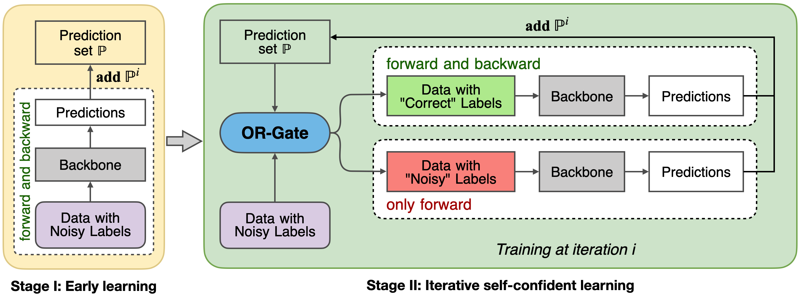

# OR-Gate
Official PyTorch implementation of the paper "Robust Training for Speaker Verification against Noisy Labels" in INTERSPEECH 2023.

## Data preparation
`./required_data.sh`

## Training
`./run.sh`

* `main.py`: Main program framework;
* `parser.py`: Parameters and experimental settings. 
  * train_list_path: Training file path;
  * device: GPU device;
  * warm_up: The first stage trains the number of epochs (default: warm_up=5), when `warm_up=max_epochs` is baseline;
  * topk: The value of k in the top-k mechanism (default: topk=90).

## Results

VoxCeleb 1 (EERs):

| noisy rate  |  0%  |  5%  | 10%  | 20%  | 30%  |  50%  |
|:-----------:|:----:|:----:|:----:|:----:|:----:|:-----:|
|  Baseline   | 4.36 | 5.30 | 6.24 | 7.99 | 9.78 | 14.39 |
| **OR-Gate** | 4.08 | 4.07 | 4.22 | 4.28 | 4.41 | 5.53  |

VoxCeleb 2 (EERs):

| noisy rate  |  0%  |  5%  | 10%  | 20%  | 30%  | 50%  |
|:-----------:|:----:|:----:|:----:|:----:|:----:|:----:|
|  Baseline   | 1.69 | 1.72 | 1.90 | 2.21 | 2.88 | 4.32 |
| **OR-Gate** | 1.64 | 1.65 | 1.62 | 1.67 | 1.72 | 1.97 |

## Acknowledge
* [Lantian Li/Sunine](https://gitlab.com/csltstu/sunine)
