# OR-Gate: a noisy label filtering method for speaker verification

## Main experiment

### Baseline

The following figure shows the performance curve of our training with ResNet34 on different proportions of noisy labels, and it can be seen that the performance of the model decreases with increasing noisy labels.

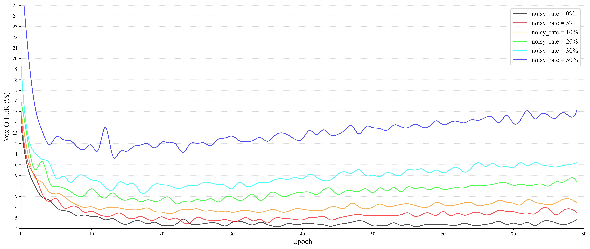

### *OR-Gate* ($w=5,k=90$)

The following figure shows the performance curves of our training using the OR-Gate on different proportions of noisy labels. The model performance does not differ much when the proportion of noisy labels is relatively lower, illustrating that a small reduction in the amount of data does not lead to performance degradation.

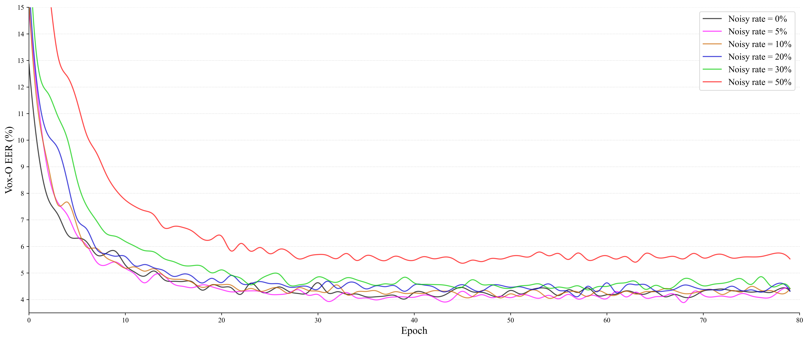

## Ablation experiments

### The *OR-Gate* with different $w$ 

We explore the effect of $w$ on performance by fixing $k=90$.

Noisy_rate = 0% :

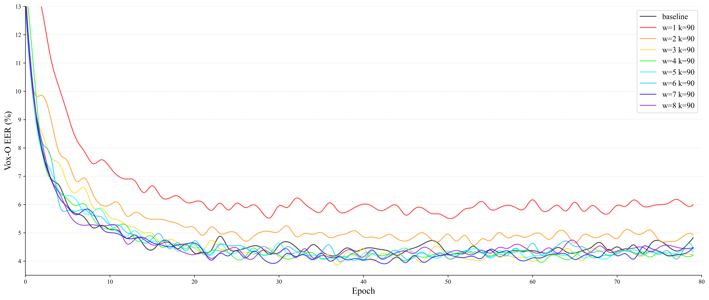

Noisy_rate = 5% :

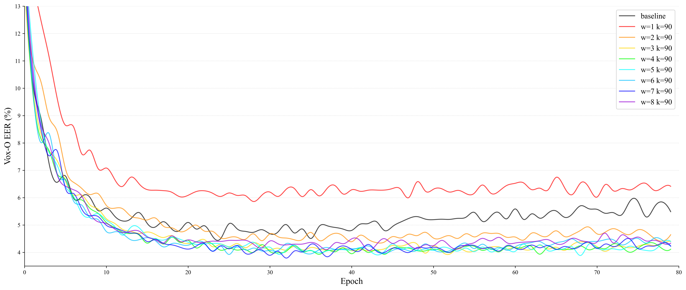

Noisy_rate = 10% :

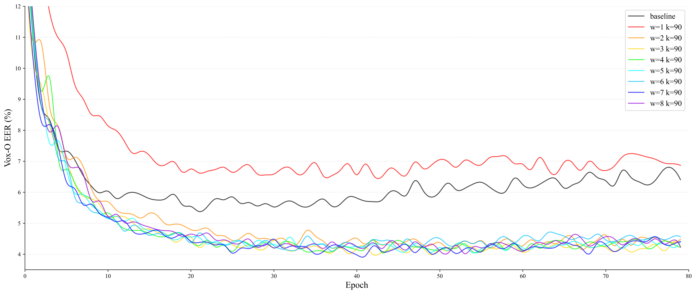

Noisy_rate = 20% :

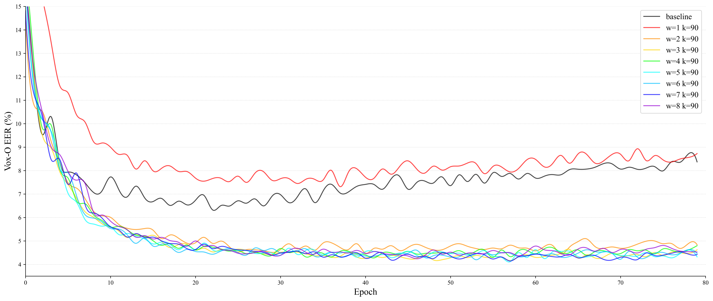

Noisy_rate = 30% :

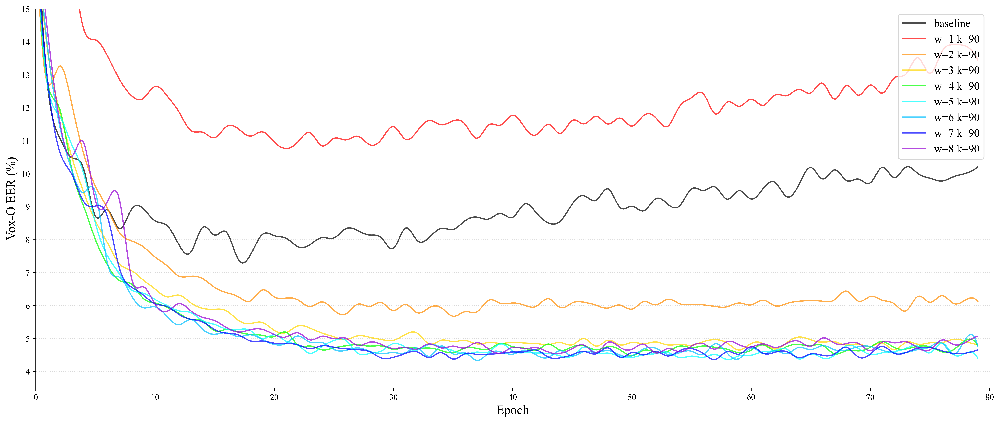

Noisy_rate = 50% :

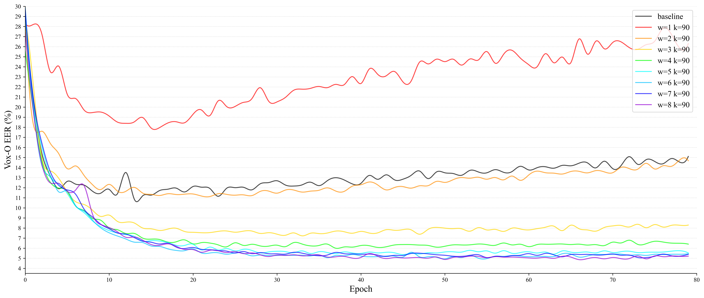

From the above training performance curve graphs, it can be seen that:

1. The low *warm-up* time is not sufficient to stimulate the potential of the *OR-Gate*.
2. The use of the *OR-Gate* is slightly better than the baseline when there are no noisy labels.
3. The use of appropriate *warm-up* time can greatly improve the performance of the model when noisy labels exist in the training data.
4. The *warm-up* time does not need to be carefully designed, and good results can be achieved in a wide range.

### The OR-Gate with different $k$ 

We explore the effect of $k$ on performance by fixing $w=5$.

Noisy_rate = 0% :

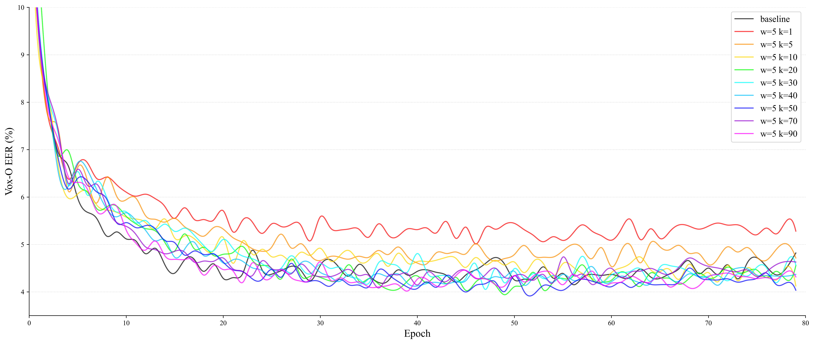

Noisy_rate = 5% :

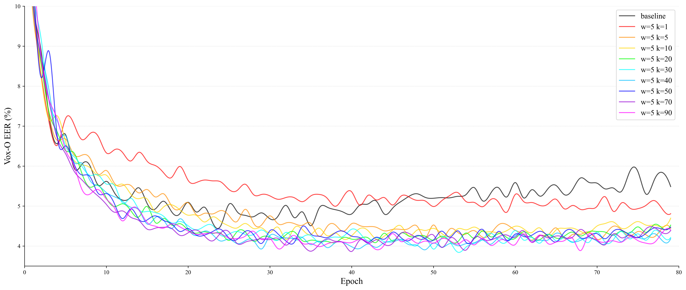

Noisy_rate = 10% :

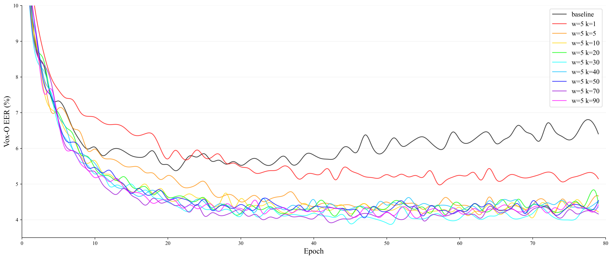

Noisy_rate = 20% :

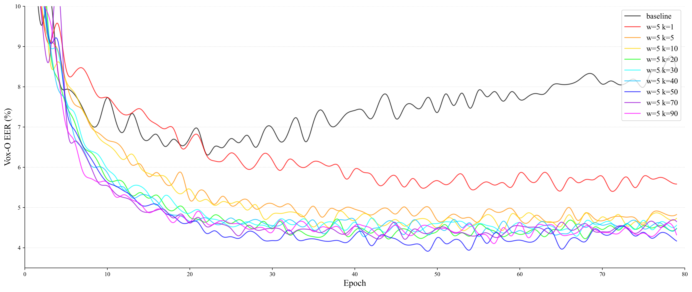

Noisy_rate = 30% :

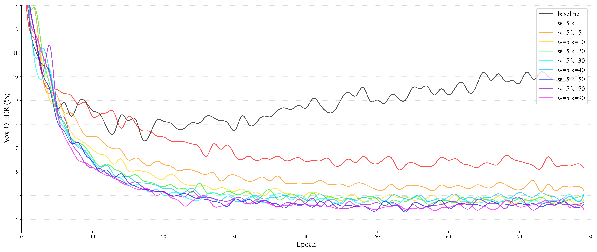

Noisy_rate = 50% :

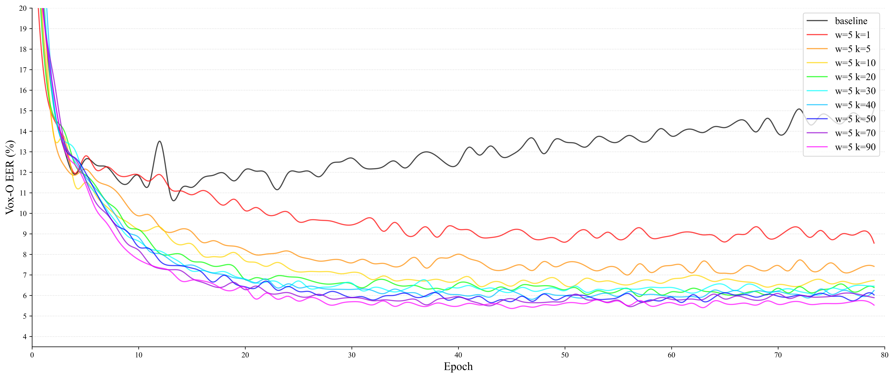

From the above training performance curve graphs, it can be seen that:

1. Using the *top-k* mechanism works better than not using the *top-k* mechanism ($k=1$, red curve).
2. In general, the value of $k$ does not need to be carefully designed, and good results can be achieved over a wide range.
3. In the case of a large proportion of noisy labels, the larger the value of $k$, the better the model performance.

## Using the OR-Gate on different backbones

Using the OR-Gate for TDNN:

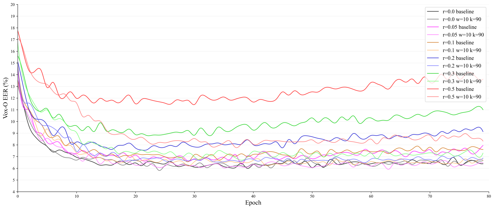

Using the OR-Gate for ECAPA-TDNN:

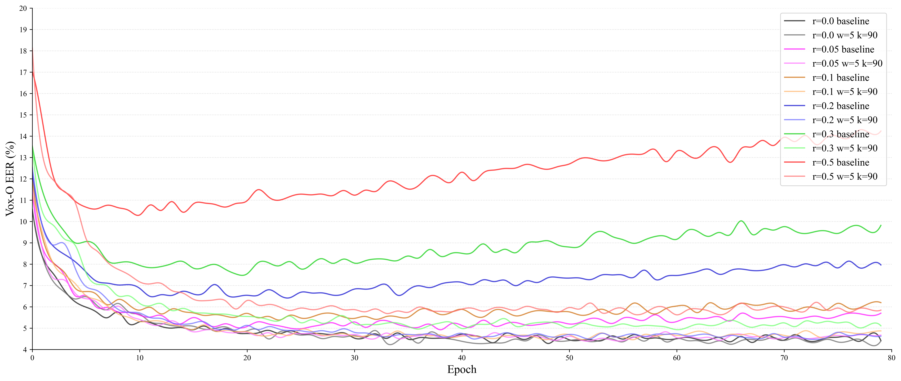

Using the OR-Gate for ResNet34:

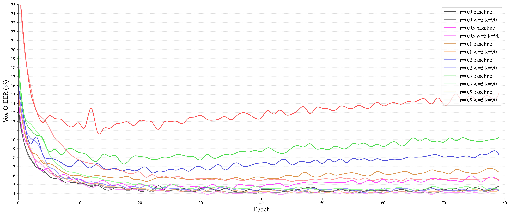

The above results show that the *OR-Gate* achieves excellent performance for different backbones in noisy label environments, and demonstrated the transportability of the *OR-Gate*.
